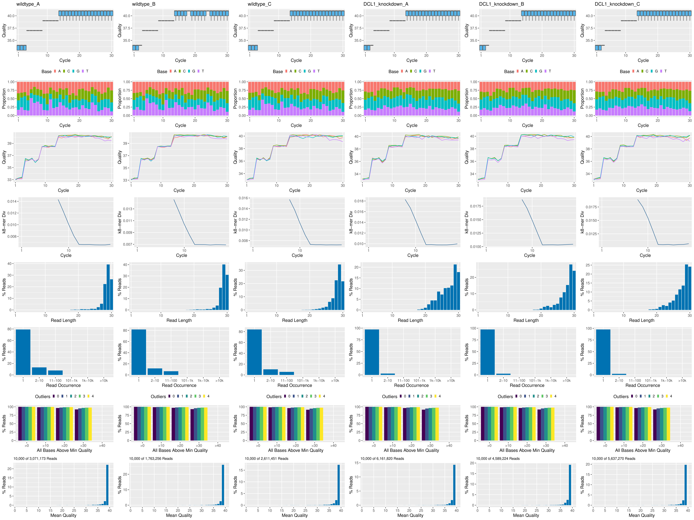

```{css, echo=FALSE}
pre code {
white-space: pre !important;
overflow-x: scroll !important;
word-break: keep-all !important;
word-wrap: initial !important;
}
```

```{r style, echo = FALSE, results = 'asis'}
BiocStyle::markdown()
options(width=80, max.print=1000)
knitr::opts_chunk$set(
    eval=as.logical(Sys.getenv("KNITR_EVAL", "TRUE")),
    cache=as.logical(Sys.getenv("KNITR_CACHE", "TRUE")), 
    tidy.opts=list(width.cutoff=60), tidy=TRUE)
```

```{r setup, echo=FALSE, message=FALSE, wwarning=FALSE, eval=TRUE}
suppressPackageStartupMessages({
    library(systemPipeR)
    library(batchtools)
})
```
# Introduction 

Users want to provide here background information about the design of their miRNA-Seq 
project.

# Samples and environment settings

## Define environment settings and samples

A typical workflow starts with generating the expected working environment
containing the proper directory structure, input files, and parameter settings.
To simplify this task, one can load one of the existing NGS workflows templates
provided by _`systemPipeRdata`_ into the current working directory. The
following does this for the _`mirnaseq`_ template. The name of the resulting
workflow directory can be specified under the _`mydirname`_ argument. The
default _`NULL`_ uses the name of the chosen workflow. An error is issued if a
directory of the same name and path exists already. On Linux and OS X systems
one can also create new workflow instances from the command-line of a terminal as shown
[here](http://bioconductor.org/packages/devel/data/experiment/vignettes/systemPipeRdata/inst/doc/systemPipeRdata.html#generate-workflow-template).
To apply workflows to custom data, the user needs to modify the _`targets`_ file and if
necessary update the corresponding _`.cwl`_ and _`.yml`_ files. A collection of pre-generated _`.cwl`_ and _`.yml`_ files are provided in the _`param/cwl`_ subdirectory of each workflow template. They
are also viewable in the GitHub repository of _`systemPipeRdata`_ ([see
here](https://github.com/tgirke/systemPipeRdata/tree/master/inst/extdata/param)).

```{r load_package, eval=FALSE}
library(systemPipeR)
library(systemPipeRdata)
genWorkenvir(workflow="systemPipeR/SPmirnaseq", mydirname="mirmaseq")
setwd("mirnaseq")
```

## Experiment definition provided by `targets` file

The `targets` file defines all FASTQ files and sample
comparisons of the analysis workflow.

```{r load_targets, eval=TRUE}
targetspath <- system.file("extdata", "targets_mirnaseq.txt", package = "SPmirnaseq")
targets <- read.delim(targetspath, comment.char = "#")
targets
```

## Project initialization

To create a Workflow within _`systemPipeR`_, we can start by defining an empty
container and checking the directory structure:

```{r SPRproject, eval=TRUE}
sal <- SPRproject() 
```

## Required packages and resources

The `systemPipeR` package needs to be loaded [@H_Backman2016-bt].

```{r load_SPR, message=FALSE, eval=TRUE, spr='r'}
appendStep(sal) <- LineWise({
                            library(systemPipeR)
                            }, 
                            step_name = "load_SPR")
```
# Read Preprocessing

## Read Preprocessing with _`Cutadapt`_

[Cutadapt](https://cutadapt.readthedocs.io/en/stable/) [@Martin2011-bh] finds and removes adapter 
sequences, primers, poly-A tails and other types of unwanted sequence
from your high-throughput sequencing reads. Reads from miRNA sequencing contain 
the 3’ sequencing adapter because the read is longer than the molecule that is sequenced.
Please find full [documentation](https://cutadapt.readthedocs.io/en/stable/installation.html) 
for installing the software on your system and the [user guide](https://cutadapt.readthedocs.io/en/stable/guide.html). 

The parameter settings of the _Cutadapt_ are defined in the `cutadapt.cwl` and 
`cutadapt.yml` files. The following shows how to construct the corresponding `SYSargsList` object:

```{r cutadapt, eval=TRUE, spr='sysargs'}
targetspath <- system.file("extdata", "targets_mirnaseq.txt", package = "SPmirnaseq")
appendStep(sal) <- SYSargsList(step_name = "cutadapt", 
                               targets = targetspath, dir = FALSE,
                               wf_file="cutadapt.cwl", input_file="cutadapt.yml",
                               dir_path = system.file("extdata/cwl/cutadapt/", package = "SPmirnaseq"), 
                               inputvars=c(FileName="_FASTQ_PATH1_", SampleName="_SampleName_"), 
                               dependency = "load_SPR",
                               run_step = "mandatory")
outfiles(sal)
cmdlist(sal)
```

## Read Preprocessing with _`preprocessReads`_ function

The function _`preprocessReads`_ allows to apply predefined or custom
read preprocessing functions to all FASTQ files referenced in a
_`SYSargs2`_ container, such as quality filtering or adaptor trimming
routines. The paths to the resulting output FASTQ files are stored in the
_`output`_ slot of the _`SYSargs2`_ object. Internally,
_`preprocessReads`_ uses the _`FastqStreamer`_ function from
the _`ShortRead`_ package to stream through large FASTQ files in a
memory-efficient manner. The following example performs adapter trimming with
the _`trimLRPatterns`_ function from the _`Biostrings`_ package.
After the trimming step a new targets file is generated (here
_`targets_trim-se.txt`_) containing the paths to the trimmed FASTQ files.
The new targets file can be used for the next workflow step with an updated
_`SYSargs2`_ instance, _e.g._ running the NGS alignments with the
trimmed FASTQ files.

Construct _`SYSargsList`_ object from _`cwl`_ and _`yml`_ param and _`targets`_ files.

```{r preprocessing, message=FALSE, eval=TRUE, spr='sysargs'}
targetspath <- system.file("extdata", "targets_mirnaseq.txt", package = "SPmirnaseq")
appendStep(sal) <- SYSargsList(step_name = "preprocessing", 
                               targets = targetspath, dir = TRUE,
                               wf_file = "preprocessReads/preprocessReads-se.cwl", 
                               input_file = "preprocessReads/preprocessReads-se.yml", 
                               dir_path = system.file("extdata/cwl", package = "systemPipeR"),
                               inputvars = c(FileName = "_FASTQ_PATH1_", SampleName = "_SampleName_"), 
                               run_step = "optional",
                               dependency = "load_SPR")
```

## Preprocessing with _`TrimGalore!`_

[TrimGalore!](http://www.bioinformatics.babraham.ac.uk/projects/trim_galore/) is 
a wrapper tool to consistently apply quality and adapter trimming to fastq files, 
with some extra functionality for removing Reduced Representation Bisulfite-Seq 
(RRBS) libraries. 

```{r trimGalore, eval=TRUE, spr='sysargs'}
targetspath <- system.file("extdata", "targets_mirnaseq.txt", package = "SPmirnaseq")
appendStep(sal) <- SYSargsList(step_name = "trimGalore", 
                               targets = targetspath, dir = TRUE,
                               wf_file = "trim_galore/trim_galore-se.cwl", 
                               input_file = "trim_galore/trim_galore-se.yml", 
                               dir_path = system.file("extdata/cwl", package = "systemPipeR"),
                               inputvars = c(FileName = "_FASTQ_PATH1_", SampleName = "_SampleName_"), 
                               dependency = "load_SPR", 
                               run_step = "optional")
```

## Preprocessing with _`Trimmomatic`_

Trimmomatic [@Bolger2014-yr] is flexible read trimming tool for Illumina NGS data. Please find full documentation [here](http://www.usadellab.org/cms/?page=trimmomatic).

```{r trimmomatic, eval=TRUE, spr='sysargs'}
targetspath <- system.file("extdata", "targets.txt", package = "systemPipeR")
appendStep(sal) <- SYSargsList(step_name = "trimmomatic", 
                               targets = targetspath, dir = TRUE,
                               wf_file = "trimmomatic/trimmomatic-se.cwl", 
                               input_file = "trimmomatic/trimmomatic-se.yml", 
                               dir_path = system.file("extdata/cwl", package = "systemPipeR"),
                               inputvars = c(FileName = "_FASTQ_PATH1_", SampleName = "_SampleName_"), 
                               dependency = "load_SPR", 
                               run_step = "optional")
```

# FASTQ quality report

The following _`seeFastq`_ and _`seeFastqPlot`_ functions generate and plot a series of
useful quality statistics for a set of FASTQ files including per cycle quality
box plots, base proportions, base-level quality trends, relative k-mer
diversity, length and occurrence distribution of reads, number of reads above
quality cutoffs and mean quality distribution.  
The function _`seeFastq`_ computes the quality statistics and stores the results in a
relatively small list object that can be saved to disk with _`save()`_ and
reloaded with _`load()`_ for later plotting. The argument _`klength`_ specifies the
k-mer length and _`batchsize`_ the number of reads to a random sample from each
FASTQ file.

```{r fastq_quality, eval=TRUE, spr='r'}
appendStep(sal) <- LineWise({
                            files <- getColumn(sal, step = "cutadapt", 'outfiles') # get outfiles from cutadapt step
                            fqlist <- seeFastq(fastq=files, batchsize=10000, klength=8)
                            pdf("./results/fastqReport.pdf", height = 6, width = 4*length(fqlist))
                            seeFastqPlot(fqlist)
                            dev.off()
                            }, 
                            step_name = "fastq_quality", 
                            dependency = "cutadapt")
```

<center></center>
<div align="left">**Figure 1:** FASTQ quality report after trimming. </div></br>

### FASTQ quality report with _FASTQC_

`FastQC` is a java application that provide quality control checks on raw sequence data.

```{r fastqc, eval=TRUE, spr='sysargs'}
appendStep(sal) <- SYSargsList(step_name = "fastqc", 
                               targets = "cutadapt", dir = FALSE,
                               wf_file = "fastqc/fastqc-se.cwl", 
                               input_file = "fastqc/fastqc-se.yml", 
                               dir_path = system.file("extdata/cwl", package = "systemPipeR"),
                               inputvars = c(outfile = "_FASTQ_PATH1_"), 
                               dependency = "cutadapt", 
                               run_step = "optional")
```

# Read Alignment

After quality control, the sequence reads can be aligned to a reference genome or miRNA database. The following sessions present some NGS sequence alignment software. Select the most accurate aligner and determining the optimal parameter for your custom data set project.

For all the following examples, it is necessary to install the respective software and export the PATH accordingly. If it is available Environment Module in the system, you can load all the request software with `moduleload(modules(idx))` function.

## Alignment with _`Bowtie2`_ 

The following example runs _`Bowtie2`_ as a single process without submitting it to a cluster.

- Build _`Bowtie2`_ index.

```{r bowtie_index, eval=TRUE, spr='sysargs'}
appendStep(sal) <- SYSargsList(step_name = "bowtie_index", 
                               targets = NULL, dir = FALSE,
                               wf_file = "bowtie2/bowtie2-index.cwl", 
                               input_file = "bowtie2/bowtie2-index.yml", 
                               dir_path = system.file("extdata/cwl", package = "systemPipeR"),
                               inputvars = NULL, 
                               dependency = "cutadapt", 
                               run_step = "mandatory")
```

Building all the command-line:

```{r bowtie2_mapping, eval=TRUE, spr='sysargs'}
appendStep(sal) <- SYSargsList(step_name = "bowtie2_mapping", 
                               targets = "cutadapt", dir = TRUE,
                               wf_file = "bowtie2/workflow_bowtie2-mapping-mi.cwl", 
                               input_file = "bowtie2/bowtie2-mapping-mi.yml", 
                               dir_path = system.file("extdata/cwl", package = "systemPipeR"),
                               inputvars=c(outfile="_FASTQ_PATH1_", SampleName="_SampleName_"), 
                               dependency = c("bowtie_index"), 
                               run_session = "local", 
                               run_step = "mandatory")
```

Please note that each experiment and/or each species may require an optimization 
of the parameters used. Here is an example where no mismatches are allowed, 
and `-k` mode is used. There is indicative that `Bowtie2` with very sensitive 
local (`--very-sensitive-local`) argument provides better accuracy and generates 
smaller `P-values` for true positives [@Ziemann2016-mp].

### Read and alignment count stats

Generate a table of read and alignment counts for all samples.

```{r align_stats, message=FALSE, eval=TRUE, spr='r'}
appendStep(sal) <- LineWise({
                            read_statsDF <- alignStats(sal)
                            write.table(read_statsDF, "results/alignStats.xls", 
                                        row.names = FALSE, quote = FALSE, sep = "\t")
                            }, 
                            step_name = "align_stats", 
                            dependency = "bowtie2_mapping")
```

The following shows the first four lines of the sample alignment stats file provided by the systemPipeR package. 
```{r read_stats_show, eval=TRUE}
table <- system.file("extdata", "alignStats_bowtie.xls", package = "SPmirnaseq")
read.table(table, header = TRUE)## system
```

## Alignment with _`BWA`_ 

The following example runs `bwa-aln` [@Li2009-ys] as a single process without submitting it to a cluster. Please check the full documentation [here](http://bio-bwa.sourceforge.net/bwa.shtml).

Build the index:

```{r bwa_index, eval=TRUE, spr='sysargs'}
appendStep(sal) <- SYSargsList(step_name = "bwa_index", 
                               targets = NULL, dir = FALSE,
                               wf_file = "bwa/bwa-index.cwl", 
                               input_file = "bwa/bwa-index.yml", 
                               dir_path = system.file("extdata/cwl", package = "systemPipeR"),
                               inputvars = NULL, 
                               dependency = "cutadapt", 
                               run_step = "optional")
```

Please note that each experiment may require an optimization of the aligners 
parameters used. Here is an example allowing one mismatch across the entire read 
including the seed region. BWA was recommended for small RNA-seq data to recover miRNA abundance profiles [@Tam2015-gb].

Running the alignment:

```{r bwa_mapping, eval=TRUE, spr='sysargs'}
appendStep(sal) <- SYSargsList(step_name = "bwa_mapping", 
                               targets = "cutadapt", dir = TRUE,
                               wf_file = "workflow-bwa-aln/workflow_bwa-aln-se.cwl", 
                               input_file = "workflow-bwa-aln/workflow_bwa-aln-se.yml", 
                               dir_path = system.file("extdata/cwl", package = "SPmirnaseq"),
                               inputvars=c(outfile="_FASTQ_PATH1_", SampleName="_SampleName_"), 
                               dependency = c("bwa_index"), 
                               run_session = "local", 
                               run_step = "optional")
```

## Read counting for miRNA profiling experiments

Download miRNA genes from miRBase.

```{r read_counting_mirna, message=FALSE, eval=TRUE, spr='r'}
appendStep(sal) <- LineWise({
                            library(rtracklayer)
                            system("wget ftp://mirbase.org/pub/mirbase/CURRENT/genomes/ath.gff3 -P ./data/")
                            gff <- import.gff("./data/ath.gff3")
                            seqlevels(gff)
                            #system("grep '>' data/tair10.fasta")
                            #seqlevels(gff) <- c("Chr1", "Chr2", "Chr3", "Chr4", "Chr5")
                            #seqlevels(gff)
                            gff <- split(gff, elementMetadata(gff)$ID)
                            bams <- getColumn(sal, step = "bowtie2_mapping", 'outfiles')
                            bfl <- BamFileList(bams, yieldSize=50000, index=character())
                            countDFmiR <- summarizeOverlaps(gff, bfl, mode="Union", ignore.strand=FALSE, inter.feature=FALSE) # Note:                             inter.feature=FALSE important since pre and mature miRNA ranges overlap
                            rpkmDFmiR <- apply(assays(countDFmiR)$counts, 2, function(x) returnRPKM(counts=x, ranges=gff))
                            write.table(assays(countDFmiR)$counts, "results/countDFmiR.xls", col.names=NA, quote=FALSE, sep="\t")
                            write.table(rpkmDFmiR, "results/rpkmDFmiR.xls", col.names=NA, quote=FALSE, sep="\t")
                            }, 
                            step_name = "read_counting_mirna", 
                            dependency = "bowtie2_mapping")
```

```{r read_counting_show, eval=TRUE}
countDFmiR <- read.table(system.file("extdata", "countDFmiR.xls", package = "SPmirnaseq"), header = TRUE)
countDFmiR[1:4,1:4]
```

# Alignment against miRBase mature miRNA and hairpin

`sRNAbench` [@Aparicio-Puerta2019-fa] allows the expression profiling and prediction of novel microRNAs in deep 
sequencing experiments. Please find more details about this software [here](https://arn.ugr.es/srnatoolbox/static/sRNAtoolbox_manual.pdf).

```{bash sRNAbench_bs, eval=FALSE}
bowtie-build data/tair10.fasta data/tair10
cp data/*ebwt ~/sRNAtoolboxDB/index/
chmod 777 index/*ebwt
java -jar makeSeqObj.jar data/tair10.fasta
cp data/tair10.zip ~/sRNAtoolboxDB/seqOBJ/
```

```{r sRNAbench_pre, eval=TRUE, spr='sysargs'}
appendStep(sal) <- SYSargsList(step_name = "sRNAbench_pre", 
                               targets = "cutadapt", dir = TRUE,
                               wf_file = "sRNAbench/sRNAbench_pre.cwl", 
                               input_file = "sRNAbench/sRNAbench.yml", 
                               dir_path = system.file("extdata/cwl", package = "SPmirnaseq"),
                               inputvars=c(outfile="_FASTQ_PATH1_", SampleName="_SampleName_"), 
                               dependency = c("cutadapt"), 
                               run_session = "local", 
                               run_step = "mandatory")
```

```{r sRNAbench_profiling, eval=TRUE, spr='sysargs'}
# microRNA profiling (Library mapping mode)
appendStep(sal) <- SYSargsList(step_name = "sRNAbench_profiling", 
                               targets = "cutadapt", dir = TRUE,
                               wf_file = "sRNAbench/sRNAbench_profiling.cwl", 
                               input_file = "sRNAbench/sRNAbench.yml", 
                               dir_path = system.file("extdata/cwl", package = "SPmirnaseq"),
                               inputvars=c(outfile="_FASTQ_PATH1_", SampleName="_SampleName_"), 
                               dependency = c("sRNAbench_pre"), 
                               run_session = "local", 
                               run_step = "mandatory")
```

```{r sRNAbench_mapping, eval=TRUE, spr='sysargs'}
## Genome mapping mode 
appendStep(sal) <- SYSargsList(step_name = "sRNAbench_mapping", 
                               targets = "cutadapt", dir = TRUE,
                               wf_file = "sRNAbench/sRNAbench_mapping.cwl", 
                               input_file = "sRNAbench/sRNAbench.yml", 
                               dir_path = system.file("extdata/cwl", package = "SPmirnaseq"),
                               inputvars=c(outfile="_FASTQ_PATH1_", SampleName="_SampleName_"), 
                               dependency = c("sRNAbench_profiling"), 
                               run_session = "local", 
                               run_step = "mandatory")
```

# Prediction of novel microRNAs

## Prediction `sRNAbench`


```{r sRNAbench_predic, eval=TRUE, spr='sysargs'}
appendStep(sal) <- SYSargsList(step_name = "sRNAbench_predic", 
                               targets = "cutadapt", dir = TRUE,
                               wf_file = "sRNAbench/sRNAbench_predic.cwl", 
                               input_file = "sRNAbench/sRNAbench.yml", 
                               dir_path = system.file("extdata/cwl", package = "SPmirnaseq"),
                               inputvars=c(outfile="_FASTQ_PATH1_", SampleName="_SampleName_"), 
                               dependency = c("sRNAbench_mapping"), 
                               run_session = "local", 
                               run_step = "mandatory")
```

# DEG analysis with *`DESeq2`* 

The following *`run_DESeq2`* function is a convenience wrapper for
identifying DEGs in batch mode with *`DESeq2`* (Love, Huber, and Anders 2014) for any number of
pairwise sample comparisons specified under the *`cmp`* argument. Users
are strongly encouraged to consult the
[*`DESeq2`*](http://www.bioconductor.org/packages/devel/bioc/vignettes/DESeq2/inst/doc/DESeq2.pdf) vignette
for more detailed information on this topic and how to properly run *`DESeq2`*
on data sets with more complex experimental designs.


```{r deseq2, message=FALSE, eval=TRUE, spr='r'}
appendStep(sal) <- LineWise({
                            targetspath <- system.file("extdata", "targets_mirnaseq.txt", package = "SPmirnaseq")
                            targets <- read.delim(targetspath, comment = "#")
                            cmp <- readComp(file = targetspath, format = "matrix", delim = "-")
                            countDFmiR <- read.table(system.file("extdata", "countDFmiR.xls", package = "SPmirnaseq"), header = TRUE)
                            degseqDF <- run_DESeq2(countDF = countDFmiR, targets = targets, cmp = cmp[[1]],
                                                independent = FALSE)
                            DEG_list <- filterDEGs(degDF = degseqDF, filter = c(Fold = 2, FDR = 10))
                            }, 
                            step_name = "deseq2", 
                            dependency = "bowtie2_mapping")
```


# isomiR mapping and annotation 

isomiRs are miRNA sequences that have variations with respect to the reference sequence.

```{r sRNAbench_isomiR, eval=FALSE}
## Genome mapping mode 
map <- loadWorkflow(targets = targetspath, wf_file = "sRNAbench_isomiR.cwl", 
    input_file = "sRNAbench.yml", dir_path = "param/cwl/sRNAbench/")
map <- renderWF(map, inputvars = c(FileTrim = "_FASTQ_PATH1_", SampleName = "_SampleName_"))
map
cmdlist(map)[1:2]
output(map)[1:2]
runCommandline(args= map, make_bam=TRUE) 
```

## TODO: isomiRs package is designed to analyze the output of SeqBuster tool or any other tool after converting to the desire format.

# Visualization 

We can visualize the transformation effect, here `log(x+1)`, variance stabilizing
transformation (`vst`) [@Anders2010-tp], and regularized-logarithm transformation
or `rlog` [@Love2014-sh], comparing a grid of all samples, as follows:

```{r exploreDDSplot, eval=FALSE, warning=FALSE, message=FALSE}
library(systemPipeTools)
exploreDDSplot(countDFmiR, targets, cmp = cmp[[1]], preFilter = NULL, samples = c(1:6), scattermatrix = TRUE)
```

## Samples analysis

### Hierarchical Clustering Dendrogram 

The following computes the sample-wise correlation coefficients using the `stats::cor()`
function from the transformed expression values. After transformation to a distance matrix,
hierarchical clustering is performed with the `stats::hclust` function and the 
result is plotted as a dendrogram, as follows:

```{r hclustplot,eval=FALSE, warning=FALSE, message=FALSE}
exploredds <- exploreDDS(countDFmiR, targets, cmp=cmp[[1]], preFilter=NULL, transformationMethod="rlog")
hclustplot(exploredds, method = "spearman")
```

### Hierarchical Clustering HeatMap 

```{r heatMaplot_samples,eval=FALSE, warning=FALSE}
## Samples plot
heatMaplot(exploredds, clust = "samples")
```

### Principal Component Analysis

This function plots a Principal Component Analysis (PCA) from transformed expression matrix. This plot shows samples variation based on the expression values and identifies batch effects.

```{r PCAplot,eval=FALSE, warning=FALSE}
PCAplot(exploredds, plotly = TRUE)
```

## DEG Analysis Visualization 

### MA plot

This function plots log2 fold changes (y-axis) versus the mean of normalized counts 
(on the x-axis). Statistically significant features are colored.

```{r MAplot,eval=FALSE, warning=FALSE}
DEG_list <- filterDEGs(degDF = degseqDF, filter = c(Fold = 2, FDR = 10), plot = TRUE)
MAplot(degseqDF, FDR.cutoff = 0.05, comparison = "DCL1_knockdown-wildtype", 
       filter = c(Fold = 2, FDR = 10), genes="MI0000208")
```

### Hierarchical Clustering HeatMap 

If `ind` selected in the `clust` argument, it is necessary to provide the list of
differentially expressed genes for the `exploredds` subset.

```{r heatMaplot_DEG,eval=FALSE, warning=FALSE}
heatMaplot(exploredds, clust = "ind", DEGlist = unique(as.character(unlist(DEG_list[[1]]))))
```

## Volcano plot 

A simple function that shows statistical significance (`p-value`) versus magnitude
of change (`log2 fold change`).

```{r volcanoplot,eval=FALSE, warning=FALSE}
volcanoplot(degseqDF, comparison = "DCL1_knockdown-wildtype", 
       filter = c(Fold = 2, FDR = 10), genes="MI0000208")
```

# Version Information

```{r sessionInfo}
sessionInfo()
```

# Funding

This project was supported by funds from the National Institutes of
Health (NIH) and the National Science Foundation (NSF).

# References

